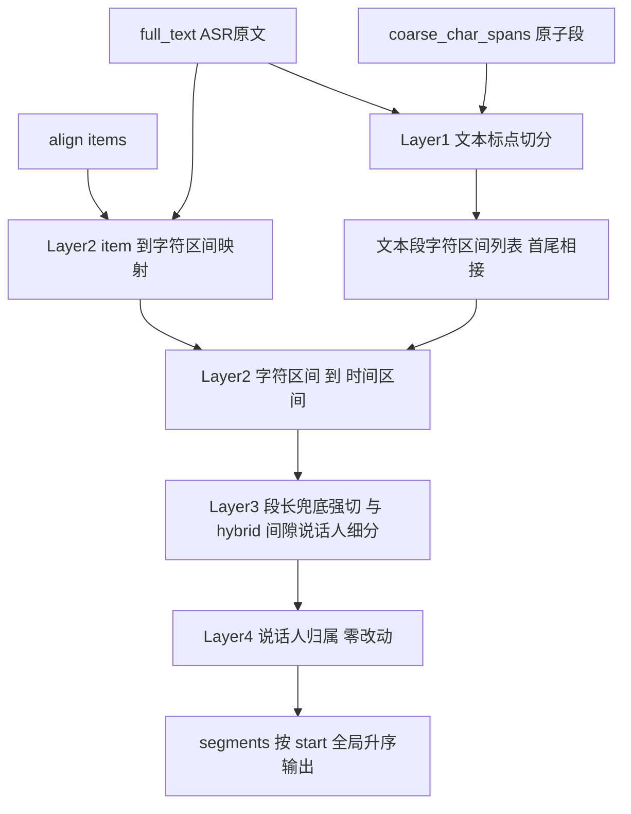

## 产品概述

将 Qwen3-ASR 服务 segment 切分从「以 align token 序列为骨架」解耦为「先按句末标点切分 ASR 原文、再把 align item 映射回字符区间取时间戳」的文本优先架构，从根上消除标点切分对 aligner 输出质量的依赖。

## 核心功能

### 1. 解耦标点切分与对齐输出（核心）

切点判定改由纯文本扫描驱动，align item 只负责提供时间戳。单个 token 匹配失败不再导致整份音频标点切分失效。

### 2. 修复四类已确认缺陷

- **路径① 全局匹配失败**（真实案例已复现）：196.544s 音频全文 75 个句末标点只切出 7 段，全部卡在 30s 段长上限。根因为身份证号 `三零二X。三零二X。` 被 `clean_token` 清洗后合并成 token `XGTDCH`，`find` 返回 -1 触发全量回退。
- **路径② coarse 段不切分**：coarse 区间在新架构下同样被文本标点切分，消除最长 180s 的超长段。
- **路径④ 游标错位（遗留❸）**：段文本改为 `full_text[c_start:c_end]` 直接切片（划分而非截取），拼接无损由构造保证；实测丢失的 5 个字符不再出现。
- **遗留❷ 尾部标点重复**：末段字符区间延伸至 `full_text` 末尾，独立 tail 逻辑不再需要。

### 3. 保持对外契约零变化

`build_segment_response` 签名不变、`segments[]` 字段名与类型不变、响应 JSON 结构不变、punctuation/hybrid 两模式与 word/segment 两归属模式行为语义不变。

### 4. 保留既有能力

hybrid 模式的间隙切分、说话人变化切分与同人二次聚合仍基于 item 序列，在新架构中作为「文本标点段之内的二次细分」保留；`_coarse_vote`、`_word_vote`、`_attribute_words`、`_fill_gaps` 等归属逻辑零改动。

### 5. 验证与回归

调整随改动失效的既有 self_test 断言（至少第 12 组 `L1291-1296`），并补充**脱敏**回归 fixture——用「重复念读 + 拉丁数字串混合 + 句末标点」的同类结构假数据复现真实故障模式，不得把真实身份证号/车牌写入仓库。

### 6. 说话人问题（仅交付配置方案，不改代码）

输出 CAM++ 启用、`max-speakers` 上界补齐、聚类阈值生效确认的配置清单与 A/B 验证步骤。

## 明确不做

- 不改 `qwen_asr/inference/qwen3_forced_aligner.py`（token 清洗逻辑保持现状，由解耦架构规避）
- 不改说话人归属算法（Q3 仅配置层）
- 不改段级响应结构与启动参数默认值

## 技术栈选型

- **语言**：Python 3.12
- **依赖约束**：`qwen_asr/service/pipeline.py` 必须保持纯标准库（模块 docstring 明令禁止 import torch / pyannote / vLLM），本次改动沿用该约束
- **架构现状**：分层清晰 —— `middleware.py`（ASR 分块 + 批量对齐 + 兜底调度）→ `pipeline.py`（纯函数组装 segment）→ ASGI 响应
- **验证工具链**：`C:\Users\gongw\.local\bin\python3.12.exe`；pipeline 用 `importlib.util.spec_from_file_location` 直接加载；middleware 需桩掉 `numpy`/`librosa`/`soundfile` 后加载

## 实现方案

### 核心思路：划分代替截取，双层解耦

现状把「在哪里切」（纯文本问题）和「切点时间戳是多少」（对齐问题）耦合成同一套 greedy `find` 机制，导致纯文本能力被 aligner 输出质量绑架。新架构拆成两层：

**Layer 1（文本层，零 aligner 依赖）**：直接扫描 `full_text` 按 `_SENTENCE_END_CHARS` 划分，coarse 字符区间作为原子段边界不可跨越。产出**首尾相接、完整覆盖**的字符区间列表。

**Layer 2（时间映射层）**：一次性建立 `item → char span` 映射（单 token 失败记为 `None` 并继续，而非全量回退）；每个文本段的时间戳 = 覆盖它的 items 的 `min(start_time)/max(end_time)`。

### 为什么「划分」能根治拼接有损

现状 `_extract_segment_text` 是**截取**：`full_text[首匹配起点:末匹配终点]`，between-span 中的字符既不在前段也不在后段，必然丢失或错位。
新方案是**划分**：段文本 = `full_text[c_start:c_end]`，相邻区间首尾相接，`"".join(segments[].text) == full_text` 由构造保证，无需任何追加/补偿逻辑。

### 关键设计决策

**D1 局部回退**：`_map_items_to_chars` 遇到匹配失败的 token 时记录 `None`、游标不推进、继续匹配后续 token。真实案例中 674 个 token 仅 1 个失败，其余 673 个位置信息完整保留，标点切分不再受牵连。

**D2 标点归属自然化**：切点位于句末标点**之后**，标点自动属于前一段，等价复现现有「句末标点附前段」语义，`puncts` 列表可整体移除。

**D3 tail 逻辑消亡**：末段 `c_end = len(full_text)`，尾部标点天然含在末段内，独立的 tail 追加逻辑与 `coarse_char_spans` 排除逻辑一并移除，遗留❷ 同时消失。

**D4 段长兜底下沉**：`max_segment_seconds` 是时间维度，文本层无法直接判断。改由 Layer 3 在拿到时间映射后，对超时段按所覆盖 items 的边界做强切，语义与现状 `span > max_segment_seconds` 保持一致。

**D5 hybrid 双维度叠加**：hybrid = 文本标点切分（保证标点维度鲁棒）+ 段内 item 序列的间隙/说话人细分（保留既有行为）。这样两模式共享 Layer 1/2，hybrid 额外走 Layer 3。

**D6 coarse 段红利**：coarse 区间内的标点在 Layer 1 同样触发切分，路径② 无需额外代码即可解决；其时间戳按字符数在 `[coarse_start, coarse_end]` 上线性分摊（近似值，但段长合理，远优于 180s 不切）。

### 性能

- Layer 1 扫描 full_text：O(n)，n 为字符数（1 小时音频约 1 万字）
- Layer 2 item 映射：O(m)，m 为 token 数（约 700~2000）
- Layer 2 时间映射：文本段与 items 均有序，用双指针 O(n+m)
- 总体与现状 O(m) 的 `str.find`（C 实现）同量级，无显著退化；新增一次 O(n) 扫描可忽略

## 架构设计



**数据流对比**

|  | 现状 | 新架构 |
| --- | --- | --- |
| 段文本 | `full_text[首匹配:末匹配]` 截取 | `full_text[c_start:c_end]` 划分 |
| 切点来源 | token 匹配位置的 between-span | 文本扫描 |
| 单 token 失败 | 全量回退，75 个标点全失效 | 仅该 token 位置丢失 |
| 段末标点 | `puncts` 列表追加 | 含在字符区间内 |
| 尾部标点 | 独立 tail 逻辑 + coarse 排除 | 末段延伸至文末 |
| coarse 段 | 整块 180s 不切 | 按标点切分 + 线性分摊时间 |


## 目录结构

```
qwen_asr/
└── service/
    ├── pipeline.py      # [MODIFY] 主改动文件（1732 行）
    │                    #   · 新增 Layer1：_split_text_spans() 纯文本切分，按 _SENTENCE_END_CHARS
    │                    #     扫描 full_text，coarse 字符区间作为原子段边界不可跨越；返回首尾相接
    │                    #     且完整覆盖 full_text 的字符区间列表（划分而非截取）
    │                    #   · 新增 Layer2：_map_items_to_chars() item→字符区间映射，单 token find
    │                    #     失败记为 None 且游标不推进（局部回退，替代 L550-551 全量回退）
    │                    #   · 新增 Layer2：_span_time_range() 字符区间→(start,end)，取覆盖该区间的
    │                    #     items 的 min(start_time)/max(end_time)；无覆盖返回 None
    │                    #   · 重构 L571-825 build_segment_response 主流程接入 Layer1/2/3；
    │                    #     段文本改为直接切片；移除 puncts 列表与独立 tail 逻辑（L759-778）；
    │                    #     coarse 段改为按文本切分后逐段线性分摊时间（L781-796）
    │                    #   · _sentence_end_boundaries(L505-568) 重构为纯映射函数或保留为 hybrid
    │                    #     内部实现；_extract_segment_text(L468-496) 随新流程退场或保留兼容
    │                    #   · _split_groups(L431-465)/_split_by_speaker(L283-311)/
    │                    #     _merge_same_speaker(L349-394) 保留，下沉为 Layer3 段内细分
    │                    #   · 归属层 L193-223/L234-280/L397-412/L415-428 零改动
    │                    #   · self_test(L833-1732) 调整第 12/17/18/19 组断言，新增脱敏回归 fixture
    └── middleware.py    # [MODIFY] 轻量：_run_asr_align 的 coarse_char_spans 计算(L528-548)保持
                         #   不变，补充注释说明其从「优化项」升级为「主路径依赖」；
                         #   L918-933 生产调用点透传不变

.trae/specs/text-first-segmentation/   # [NEW] 遵循项目惯例补充 spec 文档（可选交付）
    ├── spec.md          # Why / What Changes / Impact / Requirements
    └── tasks.md         # 任务拆解与依赖
```

## 关键代码结构

```python
@dataclasses.dataclass
class _TextSpan:
    """Layer 1 产物：文本层切分单元（首尾相接，完整覆盖 full_text）。"""
    c_start: int                      # 字符区间起点（含）
    c_end: int                        # 字符区间终点（不含）
    is_coarse: bool = False           # 是否 coarse 原子段（时间取块区间，不参与 item 映射）
    coarse_index: Optional[int] = None  # is_coarse 时对应 coarse_chunks 的下标
```

```python
def _split_text_spans(
    full_text: str,
    coarse_char_spans: Optional[List[Tuple[int, int]]] = None,
) -> List[_TextSpan]:
    """Layer 1：纯文本切分，零 aligner 依赖。

    按 _SENTENCE_END_CHARS 划分 full_text；coarse 字符区间为原子段，其边界强制
    切分且区间内切点照常生效。返回区间列表满足 spans[0].c_start == 0、
    spans[-1].c_end == len(full_text)、spans[i].c_end == spans[i+1].c_start。
    """
```

```python
def _map_items_to_chars(
    items: List[Tuple[str, float, float]],
    full_text: str,
) -> List[Optional[Tuple[int, int]]]:
    """Layer 2：item → 字符区间映射（局部回退）。

    greedy find；单个 token 匹配失败记为 None 且游标不推进，继续匹配后续 token，
    替代现状「任一失败即全量回退」语义。
    """
```

## Agent Extensions

### SubAgent

- **code-explorer**
- 用途：在重构 `_sentence_end_boundaries`（L505-568）与 `_extract_segment_text`（L468-496）前，全量核查这两个函数在 `pipeline.py` 生产路径与 `self_test` 中的全部调用点（已知生产调用 L644/L690/L719，self_test 中 `_sentence_end_boundaries` 有 7 处直接断言 L1264/1273/1282/1285/1288/1292/1299），确认无遗漏引用
- 预期结果：输出完整调用点清单与受影响断言编号，确保重构不产生悬空引用或静默行为变更